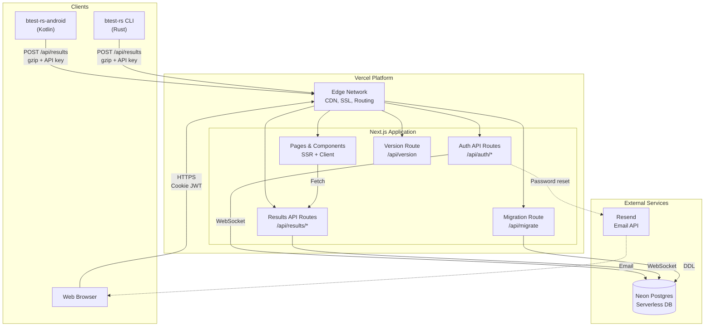
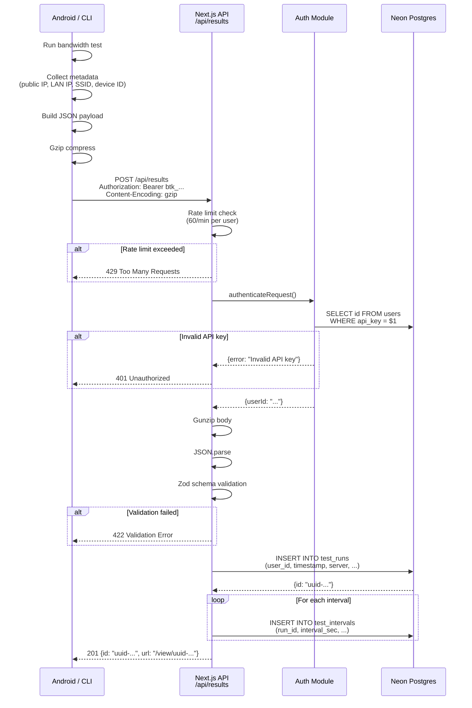
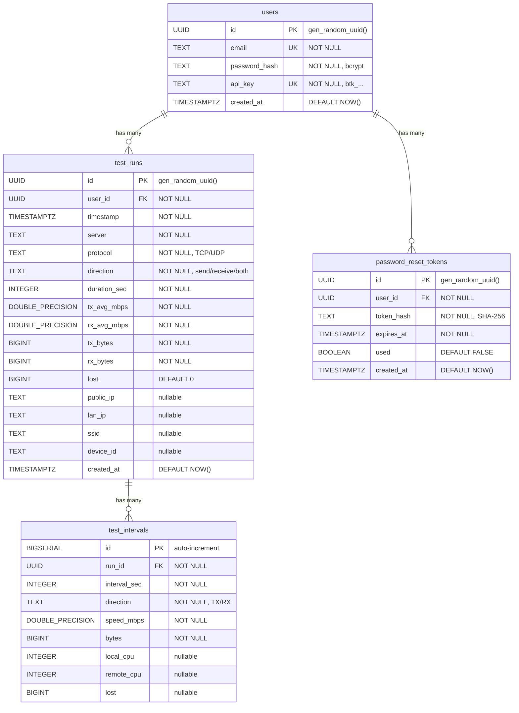
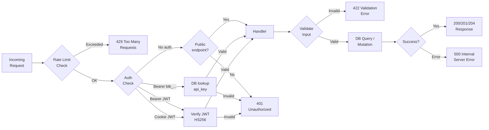

# btest-rs-web Architecture

Technical architecture documentation for developers and contributors.

---

## System Overview

btest-rs-web is the web dashboard component of the btest-rs bandwidth testing ecosystem. Three components work together:

| Component | Language | Role |
|---|---|---|
| **btest-rs** | Rust | CLI bandwidth test client and server |
| **btest-rs-android** | Kotlin | Android bandwidth test client |
| **btest-rs-web** | TypeScript | Web dashboard for storing and visualizing results |

The CLI and Android clients run bandwidth tests against a btest-rs server, then automatically submit results to a btest-rs-web instance via its REST API. Users access the web dashboard in a browser to view charts, compare runs, and export data.

---

## Tech Stack

| Layer | Technology | Purpose |
|---|---|---|
| Framework | Next.js 16 (App Router) | Server-side rendering, API routes, routing |
| Language | TypeScript (strict mode) | Type safety across frontend and API |
| UI | React 19 + Tailwind CSS 4 | Component rendering and styling |
| Charts | HTML Canvas (custom) | Speed chart rendering with no external charting library |
| Database | Neon Postgres (serverless) | Persistent storage for users, runs, intervals |
| DB Driver | `@neondatabase/serverless` | WebSocket-based Postgres driver for serverless environments |
| Auth | `jose` (JWT) + `bcryptjs` | Token signing/verification and password hashing |
| Validation | Zod 4 | Runtime input validation with TypeScript type inference |
| Email | Resend | Transactional email for password resets |
| Hosting | Vercel | Serverless deployment, CDN, SSL |

---

## Architecture Diagram



---

## Authentication Flow

```mermaid
flowchart TD
    Start([Client Request]) --> HasAuth{Authorization<br/>header?}

    HasAuth -->|"Bearer btk_..."| APIKeyPath[Look up API key<br/>in users table]
    HasAuth -->|"Bearer eyJ..."| JWTPath[Verify JWT<br/>with HS256]
    HasAuth -->|No header| CookiePath{Has token<br/>cookie?}

    CookiePath -->|Yes| JWTCookie[Verify JWT<br/>from cookie]
    CookiePath -->|No| Reject[401 Unauthorized]

    APIKeyPath -->|Found| Authenticated([Authenticated<br/>userId extracted])
    APIKeyPath -->|Not found| Reject

    JWTPath -->|Valid + not expired| Authenticated
    JWTPath -->|Invalid or expired| Reject

    JWTCookie -->|Valid| Authenticated
    JWTCookie -->|Invalid| Reject

    subgraph "Registration Flow"
        Reg1[POST /api/auth/register] --> Reg2[Validate email + password<br/>Zod schema]
        Reg2 --> Reg3[Check email uniqueness]
        Reg3 --> Reg4[Hash password<br/>bcrypt cost 10]
        Reg4 --> Reg5[Generate API key<br/>btk_ + 16 random bytes]
        Reg5 --> Reg6[Insert user row]
        Reg6 --> Reg7[Create JWT<br/>7-day expiry]
        Reg7 --> Reg8[Return token + api_key<br/>Set httpOnly cookie]
    end

    subgraph "Login Flow"
        Log1[POST /api/auth/login] --> Log2[Validate credentials]
        Log2 --> Log3[Find user by email]
        Log3 --> Log4[Verify password<br/>bcrypt compare]
        Log4 --> Log5[Create JWT]
        Log5 --> Log6[Return token + api_key<br/>Set httpOnly cookie]
    end

    subgraph "Password Reset Flow"
        PR1[POST /api/auth/forgot-password] --> PR2{Email<br/>enabled?}
        PR2 -->|No| PR3[501 Not Configured]
        PR2 -->|Yes| PR4[Find user by email]
        PR4 --> PR5[Invalidate existing tokens]
        PR5 --> PR6[Generate 32-byte token]
        PR6 --> PR7[Store SHA-256 hash<br/>1-hour expiry]
        PR7 --> PR8[Send email via Resend]
        PR8 --> PR9[Always return success<br/>prevents enumeration]

        PR10[POST /api/auth/reset-password] --> PR11[Hash submitted token<br/>SHA-256]
        PR11 --> PR12[Find valid unused token]
        PR12 --> PR13[Update password hash]
        PR13 --> PR14[Mark token as used]
    end
```



---

## Data Flow: Result Submission



---

## Database Schema



### Indexes

| Table | Index | Columns | Purpose |
|---|---|---|---|
| `test_runs` | `idx_test_runs_user` | `(user_id, created_at DESC)` | Fast lookup of a user's runs in reverse chronological order |
| `test_intervals` | `idx_test_intervals_run` | `(run_id, interval_sec)` | Fast retrieval of intervals for a specific run |

### Cascade Deletes

- Deleting a **user** cascades to delete all their `test_runs` and `password_reset_tokens`.
- Deleting a **test_run** cascades to delete all its `test_intervals`.

---

## Request Lifecycle



### Notes on Public Endpoints

Most endpoints require authentication. The following are exceptions:

- `GET /api/results/:id` -- Public. Anyone with the UUID can view a single test result.
- `GET /api/version` -- Public. Returns deployment metadata.
- `GET /api/migrate` -- Protected by `MIGRATE_SECRET` header (not user auth).
- `GET /api/auth/email-enabled` -- Public. Returns whether email is configured.

---

## Project Structure

```
btest-rs-web/
├── app/                          # Next.js App Router
│   ├── layout.tsx                # Root layout with dark theme
│   ├── page.tsx                  # Landing page (login/register)
│   ├── globals.css               # CSS variables and global styles
│   ├── dashboard/
│   │   └── page.tsx              # Main dashboard (client component)
│   ├── view/
│   │   └── [id]/page.tsx         # Single result view with chart
│   ├── compare/
│   │   └── page.tsx              # Multi-run comparison
│   └── api/
│       ├── auth/
│       │   ├── register/route.ts   # POST: create account
│       │   ├── login/route.ts      # POST: authenticate
│       │   ├── logout/route.ts     # POST: clear session cookie
│       │   ├── me/route.ts         # GET: current user info
│       │   ├── apikey/route.ts     # GET: view key, POST: regenerate
│       │   ├── forgot-password/route.ts  # POST: request reset
│       │   ├── reset-password/route.ts   # POST: set new password
│       │   └── email-enabled/route.ts    # GET: check email config
│       ├── results/
│       │   ├── route.ts           # GET: list runs, POST: submit run
│       │   ├── batch/route.ts     # POST: submit up to 100 runs
│       │   ├── [id]/route.ts      # GET: single run, DELETE: remove
│       │   ├── [id]/csv/route.ts  # GET: export single run as CSV
│       │   └── export/csv/route.ts # POST: bulk export as CSV
│       ├── migrate/route.ts       # GET: run database migration
│       └── version/route.ts       # GET: deployment info
├── components/
│   ├── SpeedChart.tsx             # Canvas-based speed chart
│   ├── RunTable.tsx               # Sortable, selectable run table
│   ├── StatsCard.tsx              # Summary statistic card
│   ├── IntervalTable.tsx          # Expandable interval data table
│   ├── AuthForm.tsx               # Login/register form
│   └── Filters.tsx                # Dashboard filter bar
├── lib/
│   ├── db.ts                      # Neon connection + migration DDL
│   ├── auth.ts                    # JWT, bcrypt, API key, request auth
│   ├── csv.ts                     # CSV export file generation
│   ├── rate-limit.ts              # In-memory sliding window limiter
│   └── types.ts                   # Shared TypeScript interfaces
├── scripts/
│   └── migrate.ts                 # CLI migration runner
├── .env.example                   # Environment variable template
├── vercel.json                    # Vercel framework configuration
├── package.json                   # Dependencies and scripts
└── tsconfig.json                  # TypeScript configuration
```

### Layer Responsibilities

| Layer | Directory | Responsibility |
|---|---|---|
| **Pages** | `app/` | Route definitions, page components, layouts |
| **API** | `app/api/` | REST endpoints, request handling, response formatting |
| **Components** | `components/` | Reusable UI components (all `"use client"` where interactivity is needed) |
| **Lib** | `lib/` | Shared business logic: database, auth, validation, utilities |
| **Scripts** | `scripts/` | CLI tools for development (migration) |

---

## Key Design Decisions

### Why the Neon Serverless Driver

The `@neondatabase/serverless` driver connects to Postgres over WebSocket instead of a traditional TCP connection. This is necessary because:

- Vercel serverless functions cannot maintain persistent TCP connections between invocations.
- Traditional Postgres drivers (e.g. `pg`) require a TCP connection pool, which does not work well in serverless environments.
- The Neon driver is designed specifically for this use case and handles connection setup in each invocation.

The trade-off is slightly higher latency per query compared to a pooled TCP connection, but this is acceptable for the request patterns in btest-rs-web.

### Why JWT + API Keys (Dual Auth)

The system supports two authentication methods for different use cases:

- **JWT tokens** are used by the web browser. They are stored in httpOnly cookies, expire after 7 days, and are created during login/registration. They are suitable for session-based browser interactions.
- **API keys** (`btk_` prefix) are used by the Android app and CLI. They are long-lived, do not expire, and are simpler to configure in client applications. They are stored in the database and looked up on each request.

This dual approach lets browser users have secure session management while programmatic clients have a simple, persistent credential.

API key regeneration is restricted to JWT authentication only (not API key auth), which means a leaked API key cannot be used to issue a replacement key.

### Why In-Memory Rate Limiting

The rate limiter uses a `Map` stored in process memory rather than an external store (Redis, database):

- **Simplicity**: No additional infrastructure or cost.
- **Low latency**: Rate limit checks are sub-microsecond since they read from local memory.
- **Sufficient for target scale**: btest-rs-web is designed for personal or small team use, where in-memory limiting is adequate.

Trade-offs:

- Rate limit counters reset on serverless cold starts.
- Multiple function instances have independent counters.
- Not suitable for high-traffic production APIs that need precise rate enforcement.

### Why Canvas for Charts

The speed chart uses a custom HTML Canvas renderer rather than a charting library (e.g. Chart.js, Recharts):

- **Zero dependency weight**: No additional bundle size for a charting library.
- **Matching the Android app**: The Android app also renders speed charts on a Canvas with the same color scheme (TX blue #42A5F5, RX green #66BB6A), so the visual experience is consistent.
- **Full control**: Custom nice-number axis scaling and grid rendering tailored to bandwidth data.

### Why Gzip for Submissions

Bandwidth test results include per-second interval data, which can produce payloads of 10--50 KB for a 30-second test. Gzip compression typically reduces this to 2--5 KB:

- The Android app and CLI gzip the JSON before sending (`Content-Encoding: gzip`).
- The API decompresses with `gunzipSync` before parsing.
- This reduces bandwidth usage and is especially important for mobile clients on metered connections.
- Gzip is required for batch submissions and recommended for single submissions.

---

## API Route Map

| Method | Path | Auth | Description |
|---|---|---|---|
| `POST` | `/api/auth/register` | None | Create a new account |
| `POST` | `/api/auth/login` | None | Authenticate and get JWT + API key |
| `POST` | `/api/auth/logout` | None | Clear session cookie |
| `GET` | `/api/auth/me` | JWT / API key / Cookie | Get current user info |
| `GET` | `/api/auth/apikey` | JWT / API key / Cookie | Get current API key |
| `POST` | `/api/auth/apikey` | JWT / Cookie only | Regenerate API key |
| `POST` | `/api/auth/forgot-password` | None | Request password reset email |
| `POST` | `/api/auth/reset-password` | None | Set new password with reset token |
| `GET` | `/api/auth/email-enabled` | None | Check if email is configured |
| `GET` | `/api/results` | JWT / API key / Cookie | List runs (paginated, filterable) |
| `POST` | `/api/results` | JWT / API key / Cookie | Submit a single test run |
| `POST` | `/api/results/batch` | JWT / API key / Cookie | Submit up to 100 test runs |
| `GET` | `/api/results/:id` | None (public) | View a single test run with intervals |
| `DELETE` | `/api/results/:id` | JWT / API key / Cookie | Delete a test run (owner only) |
| `GET` | `/api/results/:id/csv` | JWT / API key / Cookie | Export a single run as CSV |
| `POST` | `/api/results/export/csv` | JWT / API key / Cookie | Bulk export selected runs as CSV |
| `GET` | `/api/migrate` | `MIGRATE_SECRET` header | Run database migration |
| `GET` | `/api/version` | None (public) | Get deployment version info |

### Query Parameters for GET /api/results

| Parameter | Type | Default | Description |
|---|---|---|---|
| `page` | integer | 1 | Page number (1-based) |
| `limit` | integer | 20 | Results per page (max 100) |
| `server` | string | -- | Filter by server address |
| `protocol` | string | -- | Filter by protocol (TCP/UDP) |
| `device` | string | -- | Filter by device ID |
| `from` | ISO date | -- | Filter runs on or after this date |
| `to` | ISO date | -- | Filter runs on or before this date |
